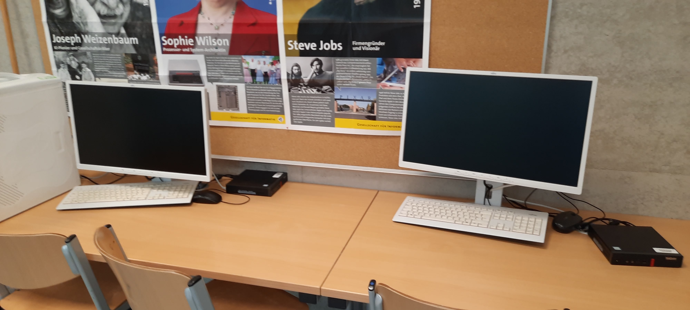

Die AG Makerspace findet jeden Freitag um 13:40 Uhr im Computerraum im Neubau (Raum 241) statt. 

Die AG wird geleitet von Herr Roschow, Herr Heupp und Herr Thon. Ihr könnt frei an euren eigenen Projekten mit den Werkzeugen vom MakerSpace arbeiten, oder anderen helfen oder lernen.