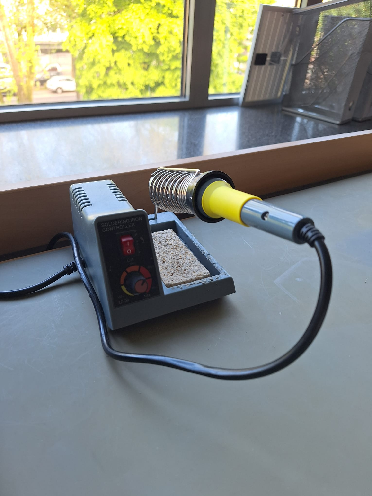

Im Makerspace gibt es viele Werkzeuge um etwas Neues zu entwickeln. Es stehen Lötkolben, PCs, ein Green Screen, Lego Mindestorms, Arduinos mit vielen Sensoren und ein 3D-Drucker zur verfügung. Ihr werdet nicht nur Wekkzeuge bekommen sondern auch Hilfe von anderen Schülern und Lehrern.

Der Steinbart Podcast wird im Makerspace gedreht.

Mit den Computern, könnt ihr beispielsweise Spiele mit Scratch, Unity oder 3D-Modelle erstellen.