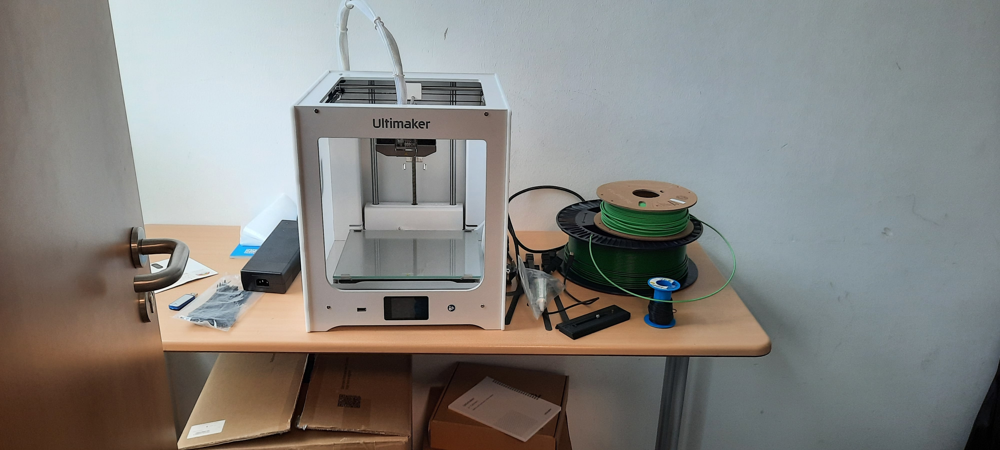

Ein Makerspace ist ein Ort wo Leute zusammenkommen um Kreative Ideen umzusetzen die mit Technik in verbindung stehen. Oft gibt es Geräte, wie zum Beispiel 3D-Drucker, oder Lötkolben, die von Mehreren Leuten benutzt werden, da viele sowas nicht selbst haben. Makerspaces sind nicht nur da um etwas zu entwickeln, sondern auch um sich mit anderen Leuten auszutauschen, zusammenzuarbeiten und zu lernen.